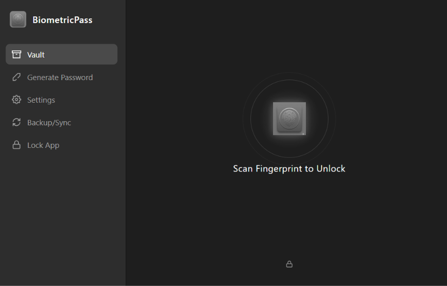

# BiometricPass

**BiometricPass** is a locally hosted, biometric-first password manager built on Electron and Node.js. 

By replacing the traditional master password with hardware-backed biometric authentication (Windows Hello, macOS Touch ID, etc.), it provides seamless, un-phishable security. The underlying data is encrypted into a portable, flat-file database (`biometricpass.enc`) that can be safely emailed, transferred via USB, or backed up to any cloud provider to sync across your devices.

## Why "No Master Password" is the Best Way

Traditional password managers rely on a single Master Password to derive your encryption keys. This creates a massive single point of failure:
1. **Human Error:** If you choose a weak master password, your entire vault can be brute-forced. If you choose a strong one, you might forget it.
2. **Keyloggers & Phishing:** If you type your master password into a compromised machine or a fake login screen, attackers instantly gain access to your entire digital life.
3. **Inconvenience:** Typing a 24-character master password every time you want to autofill a login leads to users intentionally leaving their vaults unlocked indefinitely, completely defeating the purpose.

**The BiometricPass Solution:**
Because there is no master password, BiometricPass uses a strict **hardware-bound key pair strategy**. 
During setup, the app generates a cryptographically secure 256-bit Master File Key (MFK). Instead of encrypting this key with a password you have to memorize, it hands the key directly to your operating system's native **Secure Enclave** (e.g., Windows DPAPI / TPM). 

To unlock your passwords, you simply scan your fingerprint. The hardware enclave verifies your biology and releases the key directly into volatile memory to decrypt your vault. It is completely immune to remote phishing, keyloggers, and human memory failure.

---

## Features

*   **Native Hardware Biometrics:** Uses WebAuthn and OS Secure Enclaves to strictly enforce physical biometric checks (Windows Hello, Touch ID) for every unlock.
*   **Zero-Knowledge Flat-File Storage:** Completely avoids SQLite or complex database engines. Your data is stored in a single `biometricpass.enc` file that is natively encrypted using AES-256-GCM authenticated cryptography.
*   **Cross-Device Sync (Device Link Keys):** Because keys are bound to physical hardware, syncing to a new laptop requires a one-time "Device Link Key" pairing. Export the key from Device A, import it on Device B, and Device B will instantly re-encrypt the vault for its own hardware scanner.
*   **Auto-Lock Timer:** Securely purges the encryption key from volatile memory after a customizable period of inactivity (e.g., 1, 5, or 15 minutes).
*   **Clipboard Sanitizer:** Automatically clears copied passwords from the OS clipboard after 30 seconds to prevent background apps from snooping.
*   **Cryptographic Password Generator:** Built-in tool to generate highly-entropic passwords utilizing `crypto.getRandomValues()`.
*   **Utilitarian Design System:** A strict, distraction-free grayscale UI constructed natively in HTML5/CSS3.

---

## Testing & Platform Support

**Current Status: Windows 10/11 Only (Tested)**

BiometricPass relies heavily on deeply integrated OS-level APIs for hardware biometrics and Data Protection (DPAPI/Keychain). 
Currently, this application has only been strictly tested and verified on **Windows** using Windows Hello.

**Call for Contributors:**
We need the community to test and verify the biometric hooks on **macOS (Touch ID)** and **Linux (fprintd/Secret Service)**. While the Electron IPC architecture has been standardized to work cross-platform, OS-specific Secure Enclave behaviors may require minor adjustments. If you run macOS or Linux, please test the repository and submit an issue or PR!

---

## Getting Started

1. Clone the repository.
2. Run `npm install` to install Electron dependencies.
3. Run `npm start` to launch the application.
4. Scan your fingerprint to initialize your secure hardware vault!

## Building Native Binaries

BiometricPass is configured to compile into standalone executables via `electron-builder`.

To build the executable installer for your current operating system, run the respective command:

*   **Windows (.exe):** `npm run build:win`
*   **Linux (.AppImage / .deb):** `npm run build:linux`
*   **macOS (.dmg):** `npm run build:mac` *(Note: Requires a Mac machine for compilation and Apple code-signing).*

You can also run `npm run build:all` on a compatible host to build for all platforms at once. The generated binaries will be output to the `dist/` directory.

---
**Sponsor:**  
This project is sponsored by [nexuscompute.net](https://nexuscompute.net).
